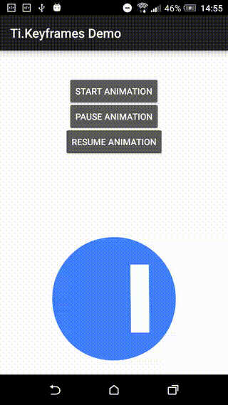

# Ti.Keyframes (Android)

Appcelerator Titanium Android module for [Facebooks Keyframes](https://github.com/facebookincubator/Keyframes) libray and for [AirBnb Lottie](https://github.com/airbnb/lottie-android). 

For an iOS version of Ti.Keyframes visit https://github.com/hansemannn/ti.keyframes and for Ti.Lottie visit https://github.com/hansemannn/ti.lottie by Hans Knoechel ([@hansemannnn](https://twitter.com/hansemannnn) / [Web](http://hans-knoechel.de))

## Requirements
- Titanium Mobile SDK 6.0.0.GA or later
- Android

## Features
- startAnimation()
- stopAnimation()
- pauseAnimation()
- resumeAnimation()
- playOnce()
- seekToProgress(percentage)
- getFrameRate()
- getFrameCount()

## Example
Please see the full-featured example in `example/app.js`.
