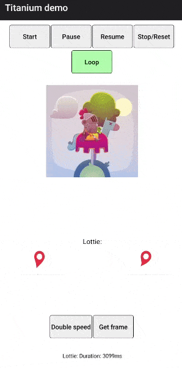

# Ti.Animation



Appcelerator Titanium Android module to support smooth and scalable animations using [Airbnb Lottie](https://airbnb.design/lottie/).

> ⚠️ The versions iOS 2.0.0 and Android 3.0.0 contain a breaking change that removed the Facebook Keyframes library. We decided to go with a Lottie only library for the future, since it made the race for the best animation library. Also, the deprecated method `addViewToLayer` is now removed. Please continue to use `addViewToKeypathLayer`.

## Migrate from iOS < 2.0.0 and Android < 3.0.0

Instead of using `createLottieView`, simply use `createAnimationView` now. That's it!

## Requirements

- Axway Titanium SDK 7.0.0+

## Library versions:

The Titanium modules use external libraries

|Library|Platform|Version|Build Date|
|---|---|---|---|
| [Airbnb Lottie](https://github.com/airbnb/lottie-android) | Android | 3.0.3 | 2019/11/30 |
| [Airbnb Lottie](https://github.com/airbnb/lottie-ios) | iOS | 2.5.2 | 2018/12/10 |


## Create a View

```js
var animation = TiAnimation.createAnimationView({
  file: 'file.json',
  loop: false,
  autoStart: false
});
```

## Update native Libraries

- iOS: Use Carthage and `carthage update` to compile the framework automatically. Then, copy the output from `ios/Carthage/Build/iOS` to `ios/platform/`.
- Android: To be documented!

## Features/Documentation

Visit the [wiki](https://github.com/m1ga/ti.animation/wiki) for the documentation.

## Example

Please see the basic example in `example/app.js`. More examples can found in the [wiki](https://github.com/m1ga/ti.animation/wiki)

## Resources

At [LottieFiles](http://www.lottiefiles.com/) you will find a list of free Lottie animations.

## Authors

- Hans Knöchel ([@hansemannnn](https://twitter.com/hansemannnn) / [Web](http://hans-knoechel.de))
- Michael Gangolf ([@MichaelGangolf](https://twitter.com/MichaelGangolf) / [Web](http://migaweb.de))
